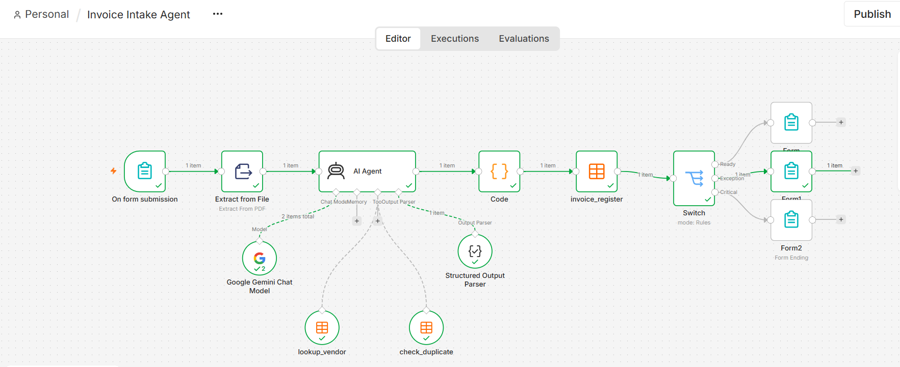
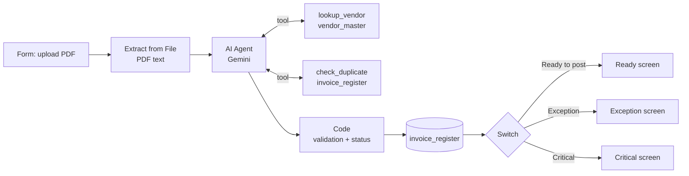
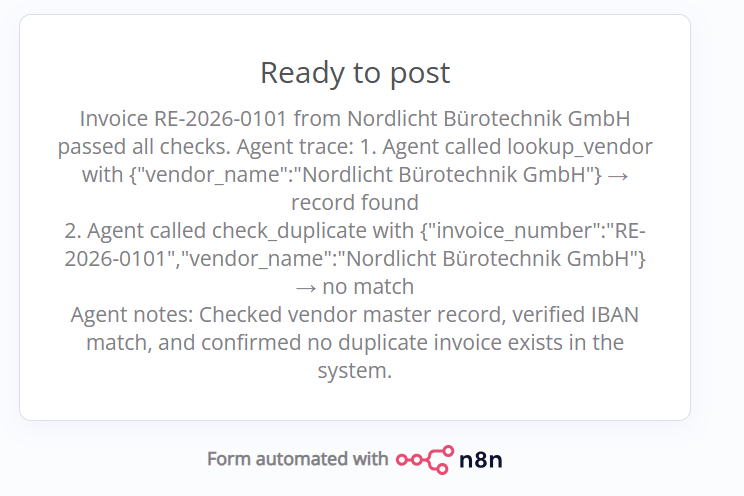
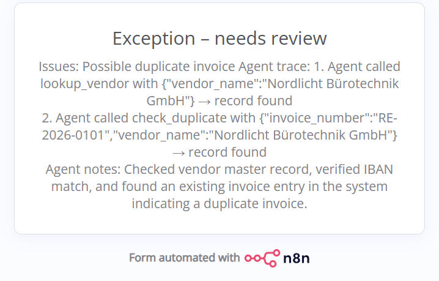
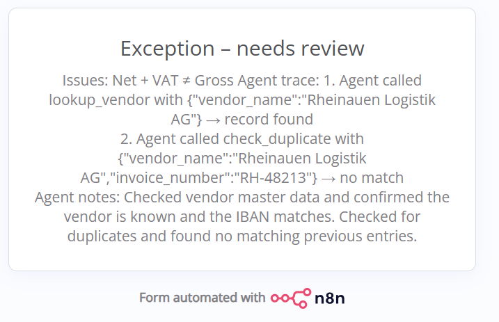
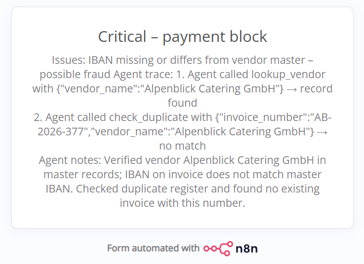
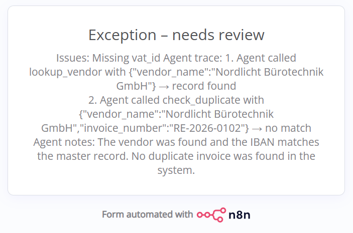
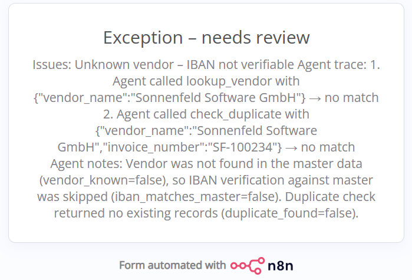
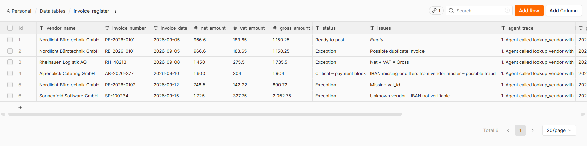
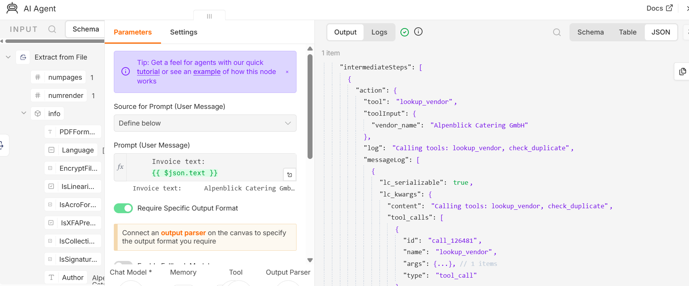

# AI Invoice Intake Agent (Demo)

Built by Sora Zhang, SAP FI/CO consultant, to explore how AI agents can support accounts-payable controls.

LinkedIn: [www.linkedin.com/in/shuyue-sora-z-31a284127](https://www.linkedin.com/in/shuyue-sora-z-31a284127)

Demo video: (link coming)

An n8n workflow that takes a supplier invoice as a PDF, lets a Gemini-based agent read it and check it against a vendor master and an invoice register, validates the result with deterministic code, and sorts it into Ready to post, Exception or Critical – payment block. Every run is written to a register with the status, the issues found and a trace of the agent's tool calls. The agent only classifies; it never posts or pays. It is a demo and runs on synthetic data only.



## The problem

In accounts payable, each incoming invoice is checked by hand: Is the vendor known? Does the bank account match what we have on file? Was this invoice already booked? Do net, VAT and gross add up? Is the VAT ID present? These checks are repetitive and easy to skip under time pressure.

Changed bank details are a common fraud pattern: a message or invoice claims the vendor has a new IBAN, and the next payment goes to the attacker. An IBAN that differs from the vendor master is therefore treated as the most serious finding in this demo.

## How it works



1. A form accepts one PDF.
2. The text is extracted from the PDF (text-based PDFs only). The invoices are in German with German number and date formats (1.234,56 €, 05.09.2026); the agent normalizes them.
3. The AI agent extracts the invoice fields and calls two tools: `lookup_vendor` (vendor master by exact name) and `check_duplicate` (invoice register by vendor name and invoice number). It returns structured JSON, including `vendor_known`, `iban_matches_master` and `duplicate_found`.
4. A Code node validates the result (see below) and sets the status.
5. The row is written to the `invoice_register` data table, and a Switch routes to the matching result screen.

The agent's system message is in [prompts/agent-system-message.md](prompts/agent-system-message.md).

## Design decisions

- **The LLM reads, code calculates.** The agent extracts fields and decides which lookups to run. The prompt tells it not to do arithmetic. The Code node checks net + VAT = gross, VAT = net × rate, the VAT rate (0, 7 or 19 %), missing fields, and sets the status.
- **Grounding check.** Every extracted `vat_id`, `iban` and `invoice_number` must appear literally in the PDF text (whitespace ignored). If it does not, the value is discarded and an issue is raised.
- **Visible tool-call trace.** The agent runs with intermediate steps enabled. The Code node turns them into a readable trace (which tool, with which input, record found or no match), shows it on the result screen and stores it in the register.
- **Exceptions are left for human review.** Anything other than a clean pass is marked Exception or Critical and left for a person to review; there is no approval step yet. The workflow does not post, pay or change any data other than the register entry.
- **Synthetic data only.** The demo uses the free Gemini API tier, which may use inputs to improve Google's products. All companies, VAT IDs and IBANs are fictitious. Do not upload real invoices.

Status rules (from the Code node): an IBAN that is missing or differs from the master for a known vendor gives **Critical – payment block**. Any other issue (unknown vendor, possible duplicate, missing VAT ID, amount mismatch, etc.) gives **Exception**. No issues gives **Ready to post**.

## Test results

Six synthetic invoices are generated by [test-data/generate_invoices.py](test-data/generate_invoices.py); the expected outcomes are in [test-data/expected_results.md](test-data/expected_results.md). Each file below produced the expected status in the workflow.

| # | File | Deliberate defect | Result | Screenshot |
|---|------|-------------------|--------|------------|
| 1 | invoice_01_clean.pdf | None | Ready to post |  |
| 2 | invoice_02_duplicate.pdf | Same vendor and invoice number as #1 | Exception – Possible duplicate invoice |  |
| 3 | invoice_03_math_error.pdf | Gross is 10,00 € above net + VAT | Exception – Net + VAT ≠ Gross |  |
| 4 | invoice_04_iban_mismatch.pdf | IBAN differs from vendor master | Critical – payment block |  |
| 5 | invoice_05_missing_vat_id.pdf | No VAT ID on the invoice | Exception – Missing vat_id |  |
| 6 | invoice_06_unknown_vendor.pdf | Vendor not in vendor master | Exception – Unknown vendor |  |

Register after the six runs:



Agent output with the tool calls (invoice 4):



## Lessons learned

1. **The agent copied a value from a tool result into the extracted fields.** For invoice 5 (no VAT ID printed), the agent filled `vat_id` with the one from the vendor master record, so the missing ID went unnoticed. Fixed in two layers: a prompt constraint (extracted fields come only from the invoice text, tool results only set the three flags, an absent VAT ID must be an empty string) and the deterministic grounding check in the Code node, which discards any ID not found in the PDF text.
2. **Gemini returned dates inconsistently.** Fixed with an explicit ISO instruction in the prompt plus normalization in code: `DD.MM.YYYY` is converted to `YYYY-MM-DD`, and any other unrecognized format is raised as an issue.

## Run it locally

Prerequisites: Docker, Python 3, a Google AI Studio API key. Requires an n8n version that includes Data Tables.

1. **Start n8n:**
   ```bash
   docker run -d --name n8n -p 5678:5678 -e GENERIC_TIMEZONE=Europe/Berlin -e TZ=Europe/Berlin -v n8n_data:/home/node/.n8n docker.n8n.io/n8nio/n8n
   ```
   Open http://localhost:5678.
2. **Import the workflow:** create a new workflow and import [workflow/invoice-intake-agent.json](workflow/invoice-intake-agent.json) (menu → Import from file).
3. **Create the Gemini credential:** add a "Google Gemini(PaLM) Api" credential with your API key and select it in the "Google Gemini Chat Model" node. The workflow uses `models/gemini-3.5-flash-lite` (Gemini 3.5 Flash-Lite) (or any current Gemini Flash model).
4. **Create two Data Tables** and select them in the nodes that reference them (`lookup_vendor`, `check_duplicate`, `invoice_register`):
   - `vendor_master`: `vendor_name` (string), `vat_id` (string), `iban` (string). Fill it from [test-data/vendor_master.csv](test-data/vendor_master.csv).
   - `invoice_register`: `vendor_name`, `invoice_number`, `invoice_date` (string); `net_amount`, `vat_amount`, `gross_amount` (number); `status`, `issues`, `agent_trace`, `processed_at` (string). Leave it empty.
5. **Generate the test PDFs:**
   ```bash
   pip install -r test-data/requirements.txt
   python test-data/generate_invoices.py
   ```
   The PDFs are written to `test-data/invoices/`. Optionally run `python test-data/verify_invoices.py` to check that each file contains exactly its intended defect.
6. **Run:** click Execute workflow, which opens the test form, or publish the workflow to use the production form URL. Upload the invoices in order 1–6. Invoice 2 is only a duplicate if invoice 1 has been registered first.

## AI-assisted development

The test data generator, the verification script and this README were drafted with Claude Code. The prompts used are in [prompts/](prompts/): the agent's system message, the test data generator and the README generator. Output was reviewed and tested before use (for example, `verify_invoices.py` checks that the PDFs contain exactly the intended defects and that generation is deterministic).

## Limitations and next steps

- Text-based PDFs only; scanned or image PDFs would need OCR.
- No support for e-invoice formats (XRechnung, ZUGFeRD).
- Exceptions end at a result screen; a proper approval step for them is missing.
- Nothing is posted: a next step would be posting accepted invoices to SAP S/4HANA via its API.
- Checks only for a VAT ID; an invoice showing only the German tax number (Steuernummer), which §14 UStG also accepts, would be flagged as an Exception.
- Vendor lookup uses the exact vendor name; there is no fuzzy matching.
- Tested only with the six synthetic invoices above.

## Tech stack

- n8n (self-hosted via Docker): Form Trigger, Extract from File, AI Agent, Data Tables, Code, Switch
- Google Gemini (`gemini-3.5-flash-lite`, or any current Gemini Flash model) via the n8n Google Gemini chat model node
- Python 3 with reportlab (test PDFs) and pypdf (verification)
